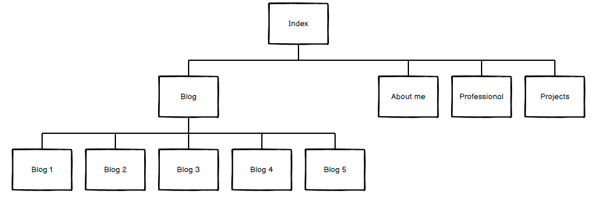
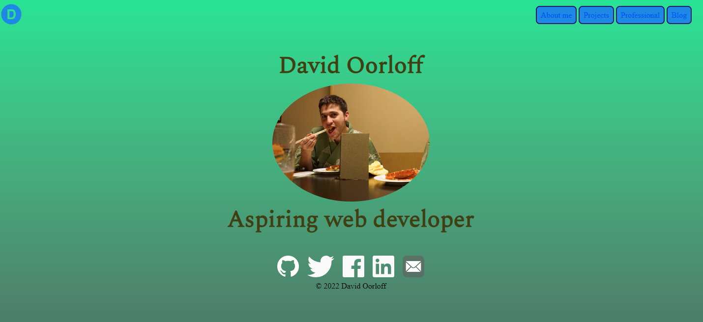
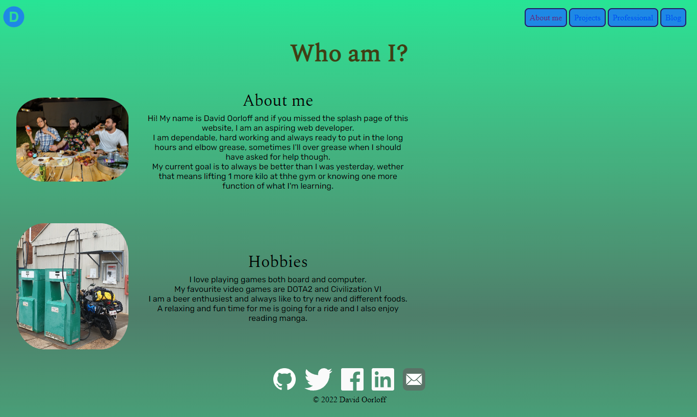
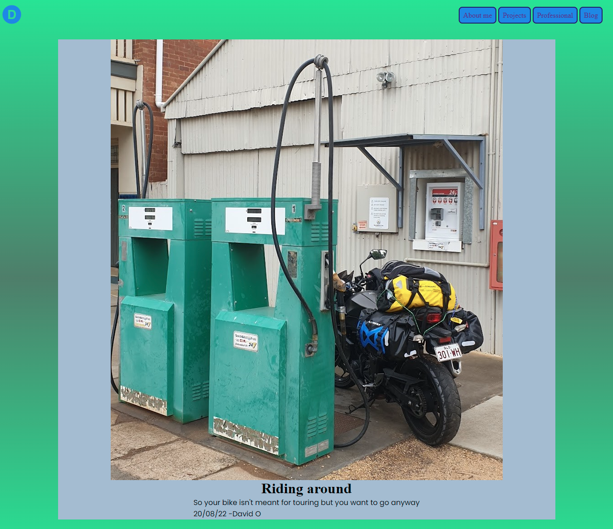
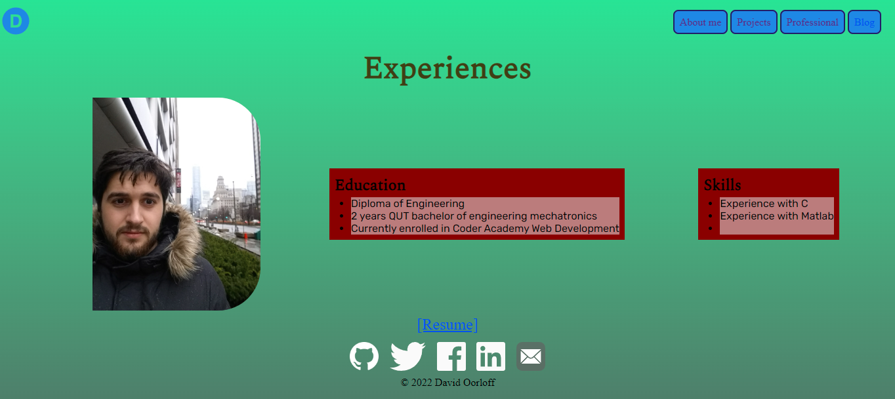

# T1A2 - Portfolio

[Project link](david-oorloff-t1a2.netlify.app)

[github repository](https://github.com/meatsheild/T1A2)

## Purpose

The purpose of this project is to provide examples of our understanding of html and css styles. Creating a virtual business card of a type to display to a prospective employer or colleague, showcasing ability personality and professionalism.

## Functionality
This website is designed to respond to users with various inputs and adapt for different screen sizes to create the best visual experience.

## Sitemap

Made using Balsamiq

## Screenshots

## Target audience
The target audience are prospective employers and other members of the Web Development trade.

## Tech stack
Made with CSS and HTML on Visual Studio
Hosted on Netlify
Wireframes and  Site map with Balsamiq
